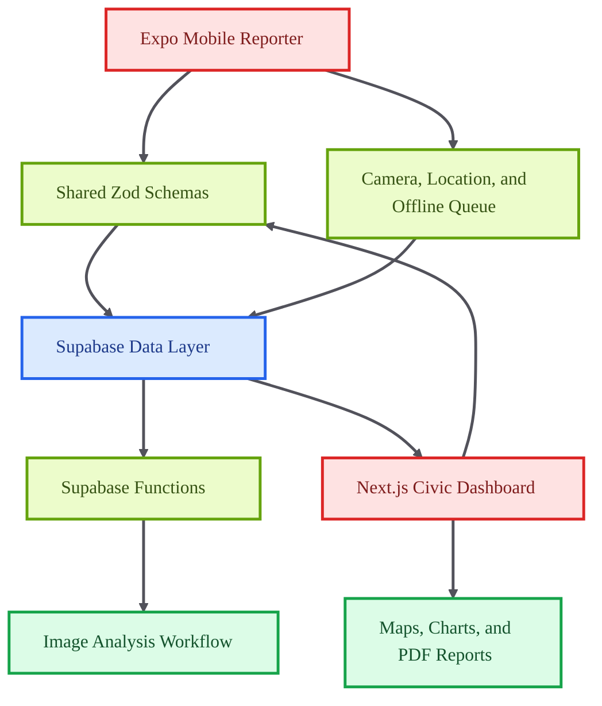

# CivicSight AI

<p align="center">

  
  
  
  
  
</p>

<p align="center">
  <strong>A civic issue reporting platform with mobile capture, web dashboards, offline-aware workflows, and shared data contracts.</strong>
</p>

CivicSight AI connects field reporting with civic oversight. The system combines a mobile app for capturing issues, a web dashboard for visualization and reporting, shared schemas for consistency, and Supabase functions for backend processing.

## Core Capabilities

- Provides mobile issue capture with camera, location, file, and offline queue support.
- Renders a web dashboard with maps, charts, exports, and issue review.
- Shares typed schemas across web, mobile, and backend layers.
- Uses Supabase functions for image analysis and data workflows.

## Technical Architecture

The repository is a TypeScript monorepo with mobile, web, shared package, and Supabase function workspaces. Turbo coordinates development while shared Zod schemas keep client and backend contracts aligned.

## Architecture Diagram



## Technology Stack

- Expo and React Native for the mobile application.
- Next.js and React for the web dashboard.
- Supabase for backend data and functions.
- Zod for shared validation schemas.
- Leaflet, Recharts, jsPDF, and offline queue utilities for reporting workflows.

## Repository Structure

- `apps/mobile` - Expo mobile application.
- `apps/web` - Next.js dashboard.
- `packages/shared` - Shared schemas and Supabase client.
- `supabase/functions/analyze-image` - Server-side image analysis workflow.
- `turbo.json` - Monorepo orchestration configuration.
- `package.json` - Workspace-level scripts.

## Getting Started

```bash
npm install
```

```bash
npm run dev
```

## Professional Context

This project demonstrates cross-platform product engineering, civic-tech workflow design, and typed monorepo architecture.
